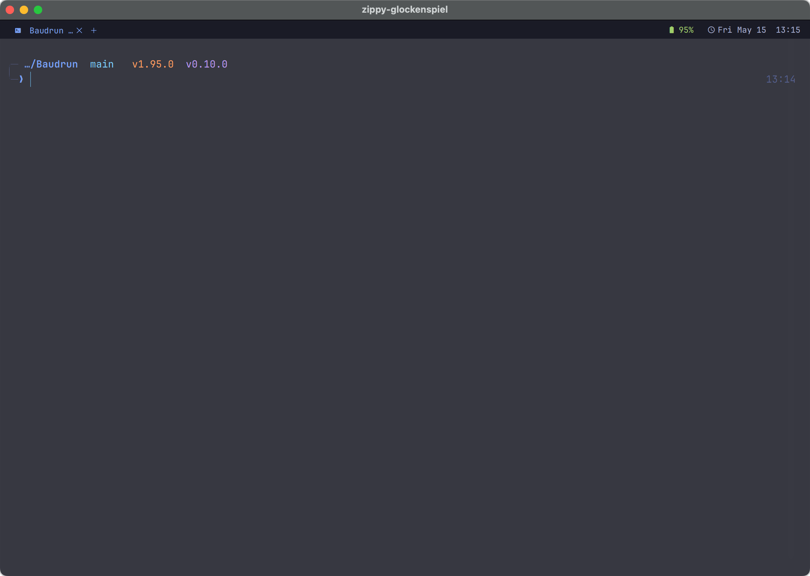
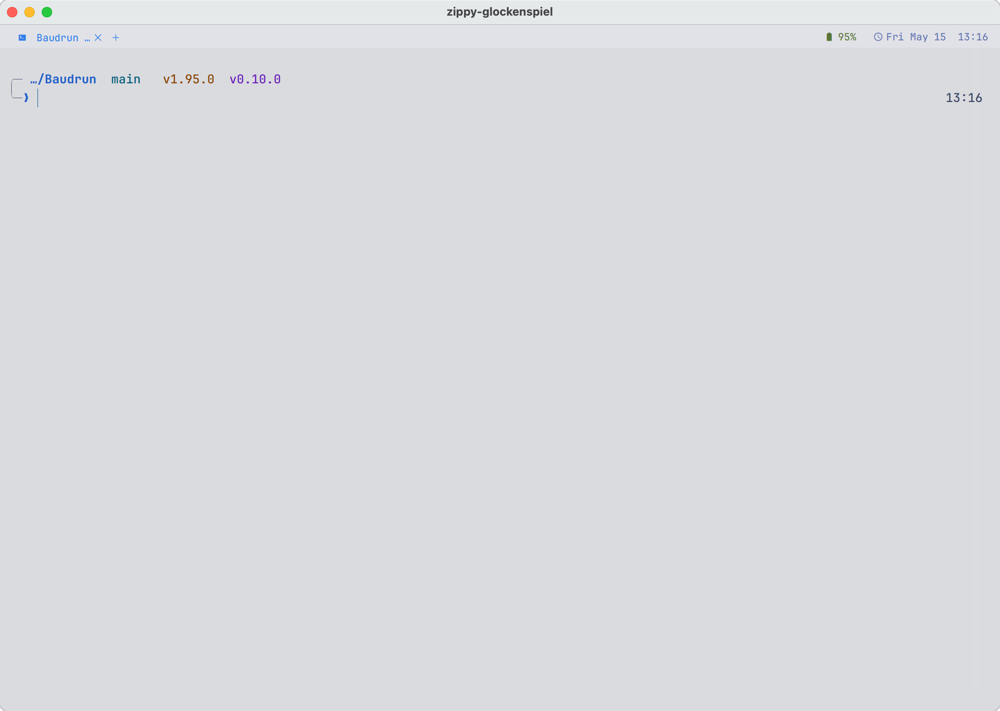

# Tokyo Night Shell

A coordinated **Tokyo Night** theme for [WezTerm](https://wezfurlong.org/wezterm/)
and [Starship](https://starship.rs/) on macOS — with one trick: the terminal
chrome and the prompt palette **swap live between dark and day variants when
you toggle System Settings → Appearance**, no shell restart.

<p align="center">
  <a href="screenshots/dark_theme.png"></a>
  <a href="screenshots/light_theme.png"></a>
</p>
<p align="center"><sub><i>Same shell, same session — flipped by toggling System Settings → Appearance.</i></sub></p>

## What's in the box

```
tokyo-night-shell/
├── install.sh                   one-shot installer (idempotent)
├── uninstall.sh                 restores backups, removes the .zshrc block
├── wezterm/wezterm.lua          WezTerm config
├── starship/starship.toml       Starship config
└── shell/zshrc-init.zsh         zsh hook that swaps palettes on Appearance change
```

### WezTerm (`wezterm/wezterm.lua`)

- Tokyo Night palette + Tokyo Night Day, picked at config-load via
  `wezterm.gui.get_appearance()` and live-swapped on a
  `window-config-reloaded` event
- JetBrainsMono Nerd Font with ligatures, `freetype_render_target = 'HorizontalLcd'`
- macOS vibrancy: `window_background_opacity = 0.82`, `macos_window_background_blur = 32`
- Fancy tab bar wired to `config.window_frame` so Nerd-Font process icons
  render in tab titles (uses an `icon_for(process)` table for `nvim`, `git`,
  `node`, `python`, `docker`, `claude`, etc.)
- Right-status line: workspace · battery · clock
- macOS-friendly keys: `⌘D` / `⌘⇧D` split, `⌘⌥←/→/↑/↓` navigate, `⌘↵` zoom,
  `⌘K` clear, `⌘⇧P` command palette
- Inactive-pane HSB dimming so the focused split pops

### Starship (`starship/starship.toml`)

- Two-line prompt framed by subtle `╭─` / `╰─` brackets
- Two palettes defined: `tokyo_night` and `tokyo_night_day`. The day palette is
  **darker than the canonical Tokyo Night Day** — tuned for translucent
  terminals where vibrancy mixes wallpaper into the background and washes out
  the official editor colors
- Semantic per-language colors (node green, rust orange, go cyan, lua blue,
  python yellow, ruby red, deno cyan, bun magenta, php purple)
- Compact git status with directional ahead/behind markers
- `right_format` shows the time, dim
- `❯` flips between blue (success), red (last-command failure), and `❮` green
  (vim normal mode if you use zsh-vi-mode)

### Appearance hook (`shell/zshrc-init.zsh`)

Starship can't read `defaults` itself, so:

1. On shell start, two cache files are generated from the source toml
   (`~/.cache/starship-tokyo_night.toml` and `…tokyo_night_day.toml`) — one per
   palette
2. A `precmd` hook polls `defaults read -g AppleInterfaceStyle` and points
   `STARSHIP_CONFIG` at the appropriate cache
3. The check is debounced to once per 3 seconds (using `$EPOCHSECONDS`), so
   rapid prompts skip it entirely

## Install

```bash
git clone <this-repo> tokyo-night-shell
cd tokyo-night-shell
./install.sh
```

The installer:

- Installs WezTerm, Starship, and JetBrainsMono Nerd Font via Homebrew if any
  are missing
- Timestamp-backs-up any existing `~/.wezterm.lua` and `~/.config/starship.toml`
  before overwriting (look for `*.bak.YYYYMMDD-HHMMSS` next to the originals)
- Appends a managed block to `~/.zshrc`, bracketed by

  ```
  # >>> tokyo-night-shell init >>>
  ...
  # <<< tokyo-night-shell init <<<
  ```

  so re-running the installer cleanly replaces the block instead of appending
  duplicates

After install, run `exec zsh` in any open shell — or just open a new WezTerm
window.

## Verify

Toggle **System Settings → Appearance**. The next prompt in any WezTerm shell
should swap palettes within ~3 seconds. If you want to force a refresh:

```bash
starship-resync
```

## Customize

| Want… | Edit |
|---|---|
| Different mono font | `font.family` and `window_frame.font` in `wezterm/wezterm.lua` (must be a Nerd Font variant for tab icons) |
| No vibrancy | `window_background_opacity = 1.0` and `macos_window_background_blur = 0` in `wezterm/wezterm.lua` |
| Fewer prompt modules | Remove from the top-level `format = """ … """` in `starship/starship.toml` |
| Tweak day-palette brightness | Values under `[palettes.tokyo_night_day]` in `starship/starship.toml` |
| Less frequent appearance polling | Bump the `3` in `(( now - __starship_last_appearance_check < 3 ))` inside `shell/zshrc-init.zsh` |

After editing any config in the package, re-run `./install.sh`. After editing
the installed configs directly (`~/.wezterm.lua`, `~/.config/starship.toml`),
run `starship-resync` in your shell to rebuild the palette caches.

## Uninstall

```bash
./uninstall.sh
```

Restores the **most recent** timestamped backups of `~/.wezterm.lua` and
`~/.config/starship.toml`, removes the managed block from `~/.zshrc`, and
clears the Starship caches. Leaves WezTerm, Starship, and the font installed.

## Limitations

- **macOS only** for the auto-switch. The hook uses `defaults read -g
  AppleInterfaceStyle`. On Linux it falls through to the day palette
  permanently; patches to read `gsettings get … gtk-theme` / KDE equivalents
  welcome.
- **zsh only**. The Starship config itself works in bash/fish, but the
  appearance hook is zsh-specific (uses `zsh/datetime` and `add-zsh-hook`).
- **WezTerm only**. The WezTerm config uses APIs specific to that emulator.
  The Starship half stands on its own in any terminal.
