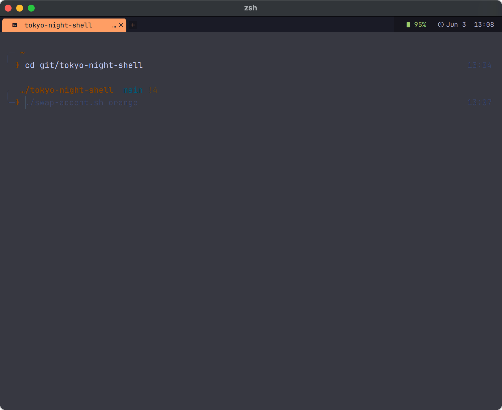
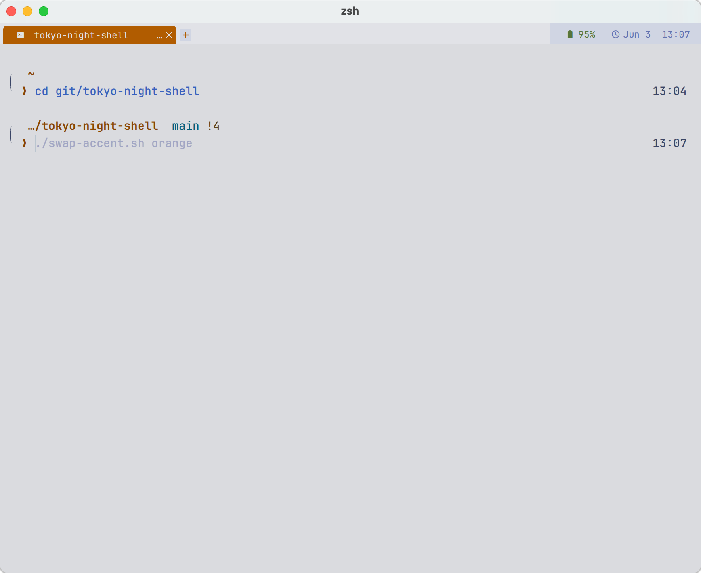

# Tokyo Night Shell

A Tokyo Night theme for [WezTerm](https://wezfurlong.org/wezterm/),
[Starship](https://starship.rs/), and [Zellij](https://zellij.dev/) that
follows the macOS light/dark setting. Toggle Appearance in System Settings
and the terminal chrome, prompt, and multiplexer all flip between the dark
and day palettes within a few seconds. No restarts, no re-sourcing.

<p align="center">
  <a href="screenshots/dark_theme.png"></a>
  <a href="screenshots/light_theme.png"></a>
</p>
<p align="center"><sub><i>Same shell, same session. The only thing that changed is System Settings → Appearance.</i></sub></p>

## Contents

- [Install](#install)
- [How the switching works](#how-the-switching-works)
- [What you get](#what-you-get)
- [Commands](#commands)
- [Customizing](#customizing)
- [Uninstall](#uninstall)
- [Notes and limitations](#notes-and-limitations)

## Install

With Homebrew:

```bash
brew install packetthrower/tap/tokyo-night-shell
tokyo-night-shell init
```

Homebrew asks you to confirm the first time you install from a third-party
tap. You can pre-approve it with `brew trust --tap packetthrower/tap`.

Add `--HEAD` to the install if you want the latest commit on `main` instead
of the last tagged release.

Or from a clone:

```bash
git clone https://github.com/packetThrower/tokyo-night-shell.git
cd tokyo-night-shell
./bin/tokyo-night-shell init
```

Either way, `init` does the actual setup. It:

- installs WezTerm, Starship, and the JetBrainsMono Nerd Font through
  Homebrew if they're missing
- backs up any existing `~/.wezterm.lua` and `~/.config/starship.toml` with
  a timestamp suffix (`*.bak.YYYYMMDD-HHMMSS`) before overwriting them
- adds a block to your `~/.zshrc` between `# >>> tokyo-night-shell init >>>`
  and `# <<< tokyo-night-shell init <<<` markers. Running `init` again
  replaces the block rather than stacking duplicates.

Then run `exec zsh`, or open a new WezTerm window.

To check that it worked, toggle System Settings → Appearance. The prompt
should switch palettes within about 3 seconds. If you're impatient, run
`starship-resync` to force it.

## How the switching works

WezTerm handles itself. It picks a palette at startup with
`wezterm.gui.get_appearance()` and re-checks whenever its config reloads,
so it reacts to Appearance changes on its own.

Starship can't watch the OS, so a small zsh hook does it instead:

1. On shell start, the hook writes two cache files from the main config,
   one per palette (`~/.cache/starship-tokyo_night.toml` and
   `~/.cache/starship-tokyo_night_day.toml`).
2. Before each prompt it checks `defaults read -g AppleInterfaceStyle` and
   points `STARSHIP_CONFIG` at the matching cache.
3. That check only runs once every 3 seconds, so mashing enter doesn't
   spawn a `defaults` process per prompt.

Zellij can't change theme mid-session, so a `zellij` shell function picks
dark or day at launch and points zellij at a cached copy of your
`config.kdl` with the `theme` line swapped in. Your real config is never
edited. A running session keeps whatever theme it started with; restart
the session to pick up a change. If you'd rather not use the wrapper, set
`theme "tokyo-night"` in `~/.config/zellij/config.kdl` yourself and skip
the auto-pick.

## What you get

```
tokyo-night-shell/
├── bin/tokyo-night-shell        the CLI (init / uninstall / swap / mode)
├── wezterm/wezterm.lua          WezTerm config
├── starship/starship.toml       Starship config
├── zellij/themes/               Zellij theme files (dark + day)
└── shell/zshrc-init.zsh         zsh hook that swaps palettes on Appearance change
```

### WezTerm

- Tokyo Night and Tokyo Night Day palettes, live-swapped on Appearance change
- JetBrainsMono Nerd Font with ligatures
- macOS vibrancy: 0.82 opacity with heavy background blur
- Tab bar with Nerd Font process icons (nvim, git, node, python, docker,
  and friends), a blue accent on the active tab, and wide click targets
- Right status line showing workspace, battery, and clock
- Mac-style keys: `⌘D` / `⌘⇧D` to split, `⌘⌥` + arrows to move between
  panes, `⌘↵` to zoom, `⌘K` to clear, `⌘⇧P` for the command palette
- Inactive panes dim slightly so the focused one stands out

### Starship

- Two-line prompt framed by `╭─` / `╰─` brackets
- Per-language version colors (node green, rust orange, go cyan, and so on)
- Compact git status with ahead/behind arrows
- Current time on the right, dimmed
- The `❯` turns red when the last command failed, and flips to a green `❮`
  in vim normal mode if you use zsh-vi-mode

The day palette here is darker than the official Tokyo Night Day. With
vibrancy on, the wallpaper bleeds into the terminal background and the
official colors wash out. These are tuned to stay readable through the blur.

### Zellij

Theme files for the pane frames, status bar, ribbons, and tables, matched
to the WezTerm palettes. They use the newer Zellij styling schema (0.40+),
so the whole UI is themed rather than just the base colors.

## Commands

| Command | What it does |
|---|---|
| `tokyo-night-shell init` | Install or refresh everything in `$HOME` |
| `tokyo-night-shell uninstall` | Restore backups and remove the `~/.zshrc` block |
| `tokyo-night-shell swap <color>` | Change the focus accent color |
| `tokyo-night-shell mode dark\|day\|auto` | Force dark or day without touching the OS setting |

### Forcing a mode

Sometimes you want a dark terminal on a light desktop:

```bash
tokyo-night-shell mode dark    # terminal goes dark, macOS stays put
tokyo-night-shell mode day     # the reverse ("light" works too)
tokyo-night-shell mode auto    # follow the OS again
tokyo-night-shell mode         # print the current setting
```

WezTerm repaints immediately, Starship follows on the next prompt, and
Zellij picks it up for new sessions.

### Changing the accent color

The accent is the color used for the prompt `❯`, the active WezTerm tab,
and Zellij's active ribbon and pane border. Blue by default. To change it:

```bash
tokyo-night-shell swap orange
```

Choices: `blue`, `cyan`, `magenta`, `green`, `yellow`, `red`, `orange`.
Each has a matching day-mode tint, so the accent survives light/dark
switches.

`swap` edits your installed dot files only (`~/.wezterm.lua`,
`~/.config/starship.toml`, `~/.config/zellij/themes/*.kdl`). If you're
working from a clone and want the change in the source too, say for a fork
or a PR, add `--repo`. Note that re-running `init` copies the source accent
back over your installed configs, so a swap without `--repo` won't survive
an `init`.

If you'd rather edit by hand: change `ACCENT_NAME` near the top of
`wezterm.lua`, the `accent =` line in each palette block of
`starship.toml`, and the two hex lines flagged by the "FOCUS ACCENT SWAP"
comment in each Zellij theme file.

## Customizing

| To get… | Edit |
|---|---|
| A different mono font | `font.family` and `window_frame.font` in `wezterm/wezterm.lua` (needs a Nerd Font for the tab icons) |
| No transparency | `window_background_opacity = 1.0` and `macos_window_background_blur = 0` in `wezterm/wezterm.lua` |
| Fewer prompt modules | Remove entries from the `format` string in `starship/starship.toml` |
| A brighter or darker day palette | Values under `[palettes.tokyo_night_day]` in `starship/starship.toml` |
| Different Zellij colors | Hex values in `zellij/themes/*.kdl` |
| Less frequent Appearance polling | The `3` in `__starship_pick_palette` inside `shell/zshrc-init.zsh` |

After editing files in the repo, re-run `tokyo-night-shell init` to install
them. After editing the installed configs directly, run `starship-resync`
or `zellij-resync` to rebuild the caches.

## Uninstall

```bash
tokyo-night-shell uninstall
```

This restores the most recent backups of `~/.wezterm.lua` and
`~/.config/starship.toml`, removes the block from `~/.zshrc`, and deletes
the Zellij themes and palette caches. WezTerm, Starship, and the font stay
installed.

## Notes and limitations

- **macOS only.** The auto-switch reads `defaults read -g
  AppleInterfaceStyle`, which doesn't exist elsewhere. On Linux everything
  stays on the day palette. If you want to port the hook,
  `gsettings get org.gnome.desktop.interface gtk-theme` is probably the
  place to start. PRs welcome.
- **zsh only.** The Starship config itself works in bash and fish, but the
  hook uses `zsh/datetime` and `add-zsh-hook`.
- **WezTerm only.** The WezTerm config obviously won't port, though the
  Starship half works in any terminal.
- **Zellij themes apply at session start.** Zellij has no theme reload, so
  a running session keeps its theme until you restart it.
